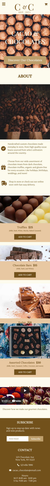

# FreeCodeCamp Product Page Project - C&C Product Page

This is my design to the [FreeCodeCamp Product Landing Page Project](https://www.freecodecamp.org/learn/responsive-web-design/responsive-web-design-projects/build-a-product-landing-page)

## Table of contents

- [Overview](#overview)
  - [Screenshots](#screenshot)
  - [Links](#links)
- [My process](#my-process)
  - [Built with](#built-with)
- [Author](#author)
- [Attributes](#attributes)

## Overview

### Screenshot

### Links

- [Live Site URL](https://aoa19.github.io/C-C-Product-Page/index.html)

## My process

### Built with

- Semantic HTML5 markup
- Flexbox
- CSS Grid
- Responsive Design
- Mobile-first workflow
- Vanilla JavaScript

## Author

- Github: [@AOA19](https://github.com/AOA19)

## Attributes
- Icons: [Font Awesome Icons](https://fontawesome.com/icons)
    - [Font Awesome License](https://fontawesome.com/license)
- Photos: [Unsplash](https://unsplash.com/)
